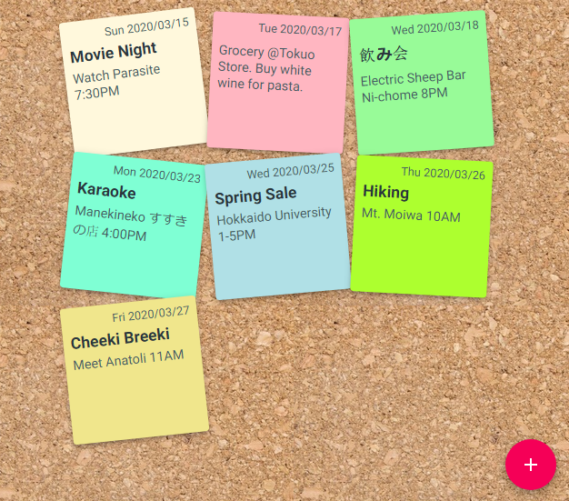

react-redux-memo
================

Sample project for React and Redux using [Material-UI](https://material-ui.com/) for styling and components.<br>
The React project was initially created using [Next.JS](https://nextjs.org/).

## Description
This is basically a todo application.<br>



## Installation
Clone repository and run

```
npm install
```


## Run
Runs the app in the development mode

```
npm run dev
```

Open [http://localhost:3000](http://localhost:3000) to view it in the browser.

The page will reload if you make edits.<br>
You will also see any lint errors in the console.


## Todo
Something to do in the future:
* Use database to store entries.
* Different users can post in the same board.

